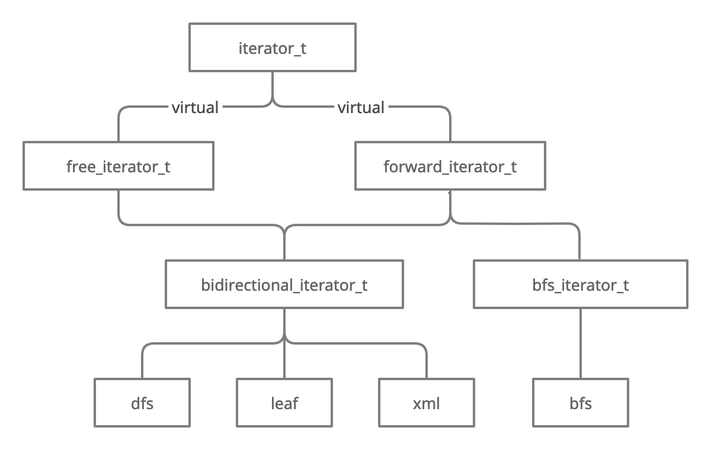

# Overview

Header-only STL-ish Unbounded Ordered Tree Library.

The priority of the library is to be as light and efficient (both memory-wise and time-wise) as possible. Any optimisation in this direction is welcome.

Any new feature will not decrease the complexity of the already-implemented algorithms.

The next priority is making the code as humanly readable as possible.

# What is an unbounded ordered tree?

A tree is an arborescent structure, a loop-free connected graph with a distinct node called the root.

Once the root of a loop-less graph is defined, the neighboring nodes of the root are its children, and the unvisited neighbors of each child of the root are its children, and so on. The nodes without children are the leaves.

An unbounded tree is a tree where each node has a variable number of children. This number is not bounded, hence "unbounded tree".

An ordered tree is a tree where there is a total order between the children of each node. So, each node has a previous sibling, except for the first child, and each node has a next sibling, except for the last child.

Here, each node is labelled with a value. The values over all nodes of a given tree are of the same type.

One can think an unbounded ordered tree as a pair made of a value and a list of unbounded ordered trees (the list can be empty). When the list is empty, the node is a leaf.

# Structure of the library

The library defines its own namespace `unbounded_ordered` where all its resources are defined.

The library provides two global classes: `node` and `tree`.

The class `node` models a node of a tree. The class contains the local pointer structure of the tree and the value stored at the node. The class is templated with the type of the value stored. The class presents all the methods manipulating itself or the underlying subtree rooted at itself.

Directly manipulating an instance of the class `node` can lead to corrupting the structure of the tree.

That is why the class `tree` is provided. It wraps around the operations implemented by `node` and makes sure that no structure gets corrupted.

The class `tree` also provides several families of iterators, as nested classes. They are used to explore the tree, as one would do with an iterator on an STL container (`list`, `vector`, `set`, etc). Each STL container provides exactly one family of iterators, because of the linearity of the container or the linearity of a given order. A tree can be explored in several ways, thus the different families of iterators, detailed below.

# The class `node`

The class `node` contains the inner structure of the tree.

It contains all the operations on itself and on the subtree rooted at itself.

The code base for that class is quite heavy, so the files are split into:
- the declarative header `node_decl.hpp`,
- the template headers `node_***.tpp` and
- the gathering header `node.hpp`.

The declarative header contains the declaration of the class.

The template headers contain the code of the methods.

The gathering header gathers the declarative header and the template headers. The gathering header is the only header to include when using the class `node`.

# The class `tree`

The class `tree` wraps around the tree-wide operations made available by the class `node`.

It also provides the different kinds of iterators:
- `forward_iterator`,
- `bidirectional_iterator`,
- BFS,
- DFS preorder,
- DFS postorder,
- Leaf.

The iterators `forward_iterator` and `bidirectional_iterator` cannot be used to actually explore the tree as they factor a few functionalities but do not implement any actual exploration.

They are here to allow to pass any kind of iterators to the methods manipulating subtrees, subtrees rooted at where the iterators point to.

The kinds of iterators actually exploring the tree are BFS, DFS preorder, DFS postorder and Leaf.

The inheritance schema of the iterator classes is as follows:

## The BFS iterators

The BFS iterators make a Breadth-First Search of the tree.

The BFS iterators are forward iterators. There are two variations: non-`const` and `const`.

One breadth-first search of the tree demands to keep track of the nodes whose children to explore, thus maintaining one such iterator can consume memory linearly proportional to the size of the tree. Overall, the wider the tree fans out, the bigger the BFS heap.

## The DFS preorder iterators

The DFS preorder iterators make a Depth-First Search in preorder of the tree. "Preorder" means each node is visited before its children.

Usually the DFS exploration is presented with a FILO (first-in-last-out) of nodes whose next sibling to explore, but the implementation here does not need this FILO. This is thanks to each node carrying a pointer to its parent. The FILO of nodes of the DFS is the path from the root to the node itself, going to the parent of a node is equivalent to popping the head of the FILO.

The memory needed by these iterators is constant, and the time complexity of going to the next/previous node is the same as if a FILO were used.

The DFS preorder iterators use the pointers to the leftmost and rightmost leaves. Maintaining these pointers reduces the complexity of several operations on these iterators.

The DFS preorder iterators are bidirectional iterators. There are four variations, any combination of:
- non-`const` and `const`,
- non-`reverse` and `reverse`.

Internally, each variation of the DFS preorder iterator considers `NULL` as its past-the-end iterator.

## The DFS postorder iterators

The DFS postorder iterators make a Depth-First Search in postorder of the tree. "Postorder" means each node is visited after its children.

The rest is the same as for the DFS preorder iterators.

## The Leaf iterators

The leaf iterators explore only the leaves of the tree.

Their memory consumption is constant and their time complexity is the same as for any DFS iterator. The underlying algorithm is a DFS exploration skipping the internal nodes of the tree.

The Leaf iterators are bidirectional iterators. There are four variations, any combination of:
- non-`const` and `const`,
- non-`reverse` and `reverse`.

Internally, each variation of the Leaf iterator considers `NULL` as its past-the-end iterator.
